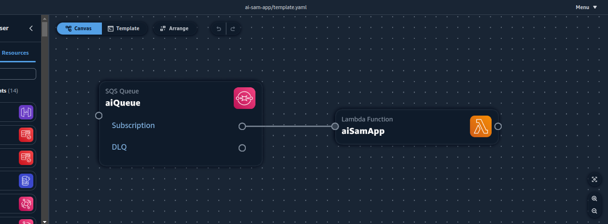

## aws

This project creates a lambda function using 2 AWS AI tools: [AWS CodeWhipsperer](https://docs.aws.amazon.com/codewhisperer/latest/userguide/what-is-cwspr.html) and [Amazon Application Composer](https://aws.amazon.com/application-composer/).

[AWS SAM](https://docs.aws.amazon.com/serverless-application-model/latest/developerguide/what-is-sam.html) and [Powertools for AWS Lambda](https://docs.powertools.aws.dev/lambda/python/latest/) are also used here.

### Diagram



### Requirements
- Python3+
- pip
- aws sam-cli - **make sure to install/update sam-cli following [these instructions](https://docs.aws.amazon.com/serverless-application-model/latest/developerguide/install-sam-cli.html#install-sam-cli-instructions)**.

### Used Tools
- `CodeWhisperer` is used to write the handler code.
- `Application Composer` is used to create the IaC/SAM Template code for the lambda internal and external components.
- `SAM CLI `is used to manage the lambda build, test, and deployment.

## Development Steps

### I - Build Repository with SAM
#### 1 - Add Lambda Powertools Dependencies
For this project, SAM is used in combination with Lambda Powertools:

1 - On local computer, open the termial.

2 - Navigate to the [Powertools docs](https://docs.powertools.aws.dev/lambda/python/latest/#quick-getting-started) and follow the steps to build the lambda repository.

<details>
<summary>Dropdown to see the main commands</summary>
<br>    

```
pip install "aws-lambda-powertools
```
```
pip install "aws-lambda-powertools[aws-sdk]
```
```
sam init --app-template hello-world-powertools-python --name sam-app --package-type Zip --runtime python3.11 --no-tracing
```
The above comands will build the repo with all the needed files and directories.
</details>

## II - Use Application Composer
In this step application composer is used to add code to the template.yaml from a diagram.
<details>
<summary>App Composer Setup Steps</summary>
<br>
a - Go to the Application Composer console in AWS 

b - Choose `Create New Project`

c - Go through the tutorial or skip it

d - In the top right corner, go to Menu -> Project Folder -> Choose the folder where SAM created the template. 

The template diagram should now be visible in the `Canvas` section of App Composer.
</details>
For this use case: 

- The API Gatewy is not needed, so it is removed (Click icon and choose delete)

- Replace it with an SQS Queue. In the left side search bar type sqs then drag and drop the sqs icon onto the `Canvas`, then connect it to the lambda symbol.

- Click each symbol to see the configurations and adjust as needed.

The changes made in App Composer should reflect in the template.yaml file in the local repo.

## III - Adjust Handler Code with CodeWhisperer and Powertools
Sam init creates a lambda handler template that needs to be changed to meet the business case.

a - For this use case (Lambda - SQS patterm), the Batch Processing utility from the Powertools is used following [these instructions](https://docs.powertools.aws.dev/lambda/python/latest/utilities/batch/#getting-started).

b- Use CodeWhisperer to create the different sections of the code/handler in two ways:
  - Type in instructions as comments, press ENTER and wait for CodeWhisperer to suggest code.
  - Start typing the code and wait for CodeWhisperer to complete it.


## Issues Encountered

- SAM CLI was outdated which caused issues when looking for the templates during `sam init`.

- **CodeWhisperer** 
    - Needed incremental instructions.
    - Developer has to know the different sections and flow of the lambda code to instruction CodeWhisperer on what to do next.
    - Code needed more troubleshooting than non AI code, like the `BatchException` and the `@batch_processor.record_handler` module was wrongly imported causing an exception.

- App Composer console resets when the browser is refreshed but backs up changes in the local repo under .aws-composer

- App Composer did not add sqs policy to lambda, it had to be added to the template maually.